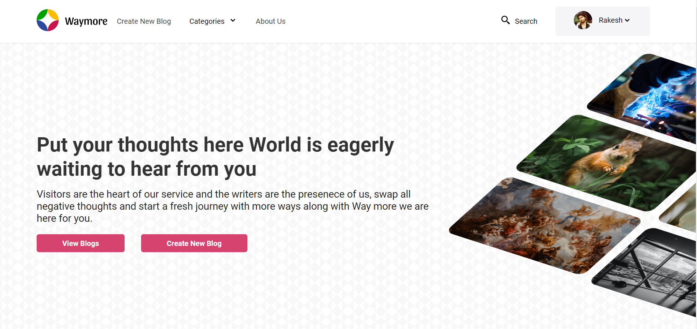
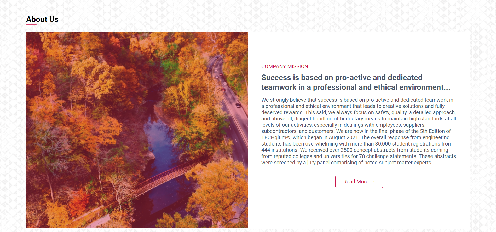

# Waymore API
A Beautiful website for content creators and daily readers to deliver thoughts among each other.

## Steps to run this project

### Create a config.env file in the server directory
```
cd server
type nul > config.env (CMD)
ni config.env (Powershall)
```

### Add the following details in config.env file
```
PORT=4500
NODE_ENV=development
JWT_SECRET
EXPIRES_IN
COOKIE_EXPIRES_IN
```

### Add the mysql database configuration information in db.config.js present in database folder
```
host
user
password
db
dialect: "mysql",
```

### Install required dependecies in both client and server
```
npm install
cd ../client
npm install
```

### Run client as well as server together
```
in client directory: ".../client" npm start
in server directory: ".../server" npm start
visit: http://localhost:3000
```

## Home Page will look like




